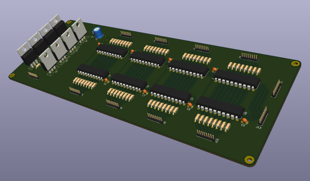

Reddit review
=============

Some guy at Reddit asked for some help routing some schematic he came up with. I'm by no
means an expert, but here's my try at it.

It's bit packed (resistors too close to each other, I guess), but I went for compactness
and I don't expect the signals to be high speed by any definition. The point here was
just to show a way to route that big bunch of traces between the 74LS574s.

Top:

Bottom:

Model:

